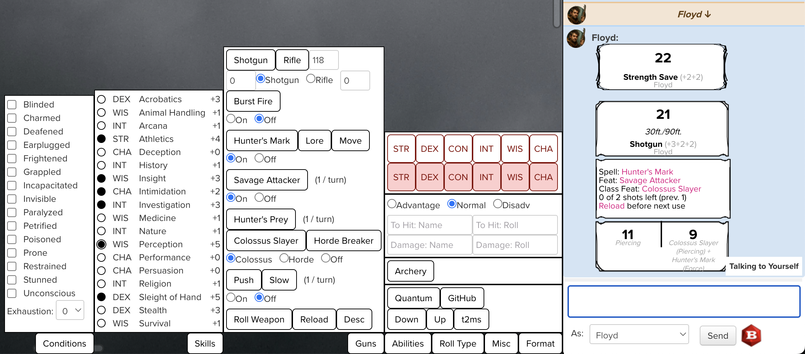

# Roll20 Custom Character Sheet

I'm not satisfied with either Roll20 character sheets or DND Beyond character sheets, so I am making my own.

## Developer Installation

1. Navigate to `chrome://extensions` in your browser

2. Enable the **Developer mode** option in the top-right

3. Press the **Load unpacked** button in the top-left and select the `roll20-character-sheet` directory in your clone of this repository

4. The extension should now show up in your list of installed extensions, open a Roll20 game to view the extension!